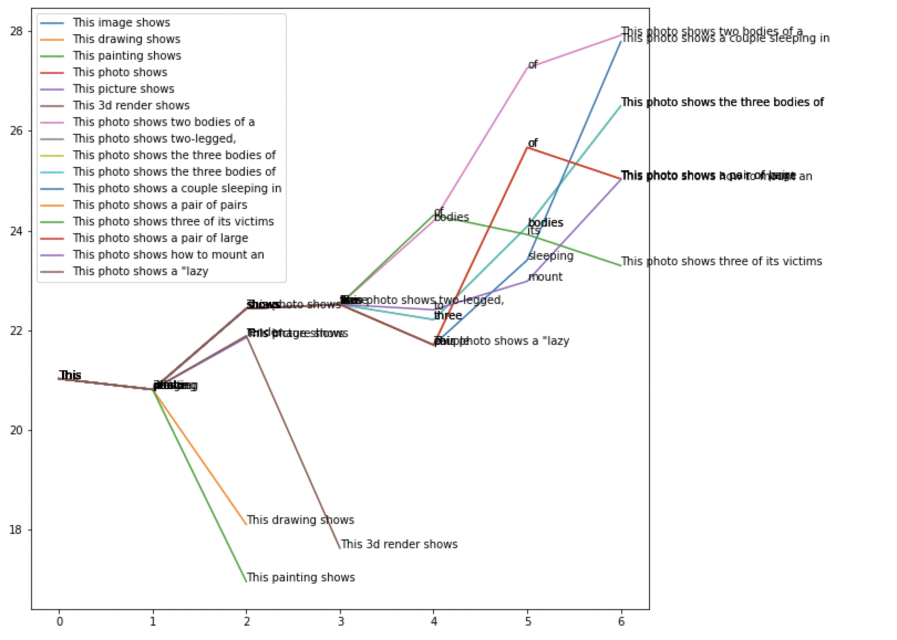

# Image Transcription using CLIP + GPT
We do image transcription by alternating between:
- letting GPT suggest a number of potential next words
- let CLIP decide which of the suggested texts is the best fit for the image

Example:


creates a following search tree (after prefiltering 10 out of 10000 proposals at each decision step):


And atfer a few iterations comes up with:
```
This photo shows two bodies of a cat (seen on Flickr, April 2011) carrying a knife
```
